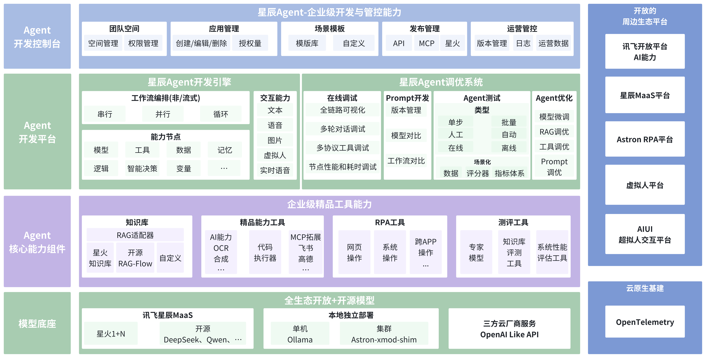

# 星辰Agent - 智能体开发平台

<div align="center">


**星辰Agent是一款专为AI开发者和各类组织打造的企业级Agent开发平台。**

[](LICENSE)
[](https://github.com/iflytek/astron-agent/releases)
[](https://github.com/iflytek/astron-agent/actions)
[](https://codecov.io/gh/iflytek/astron-agent)
[](https://github.com/iflytek/astron-agent/stargazers)

[English](README.md) | 简体中文

</div>

## 📑 目录

- [🔭 星辰 Agent 是什么](#-星辰-agent-是什么)
- [🛠️ 技术栈](#%EF%B8%8F-技术栈)
- [🚀 快速开始](#-快速开始)
  - [使用 Docker](#使用-docker)
- [📖 使用指南](#-使用指南)
- [📚 文档](#-文档)
- [🤝 参与贡献](#-参与贡献)
- [🌟 Star 历史](#-star-历史)
- [📞 支持](#-支持)
- [📄 开源协议](#-开源协议)

## 🔭 星辰 Agent 是什么

星辰 Agent 是一款面向**AI开发者与各类组织**的企业级 Agent 开发平台。它不仅提供从**模型托管、应用开发、效果优化到权限管控**的全链路能力，更创新性地融合了**智能RPA**，让 Agent 不仅能“思考”，还能真正“执行”，在跨数字系统与桌面环境中完成复杂任务链。

### 为什么选择 星辰 Agent？
- **内外同源，稳定可信**：技术内核与[讯飞星辰Agent平台](https://agent.xfyun.cn)保持一致，继承其成熟的企业级稳定性。
- **思考 + 行动的闭环**：智能RPA深度融合，让Agent从“生成答案”走向“自动完成任务”。
- **面向开发者与企业的双重价值**：开发者能快速上手并扩展，中小企业能高效落地数字化流程。

### 关键特性
- **企业级高可用**：全链路能力覆盖开发、构建、优化与管控，支持一键部署，稳定可靠。
- **智能RPA融合**：跨系统流程自动化，让Agent具备高可控执行力，实现“从决策到动作”的完整闭环。
- **即用工具生态**：集成[讯飞开放平台](https://www.xfyun.cn)海量AI能力与工具，历经数百万开发者验证，免开发快速接入。
- **灵活模型支持**：多种接入方式，支持模型API快速接入验证到企业级MaaS本地集群一键部署，满足不同规模需求。

### 开发支持
- **多语言后端**：支持 Java、Go、Python 等主流语言，前端适配 TypeScript + React 技术栈。
- **完整工具链**：提供 API 文档、部署指南、故障排查手册，降低学习与维护成本。
- **一键部署**：内置 Docker 化环境，开箱即用，快速启动项目。

## 🛠️ 技术栈

- **后端技术**: Java 21, Spring Boot 3, Go, Python 3.11
- **前端技术**: TypeScript 5, React 18
- **数据库**: MySQL 8
- **缓存**: Redis
- **消息队列**: Apache Kafka
- **基础设施**: Docker, MinIO
- **代码质量工具**: Checkstyle, PMD, SpotBugs, ESLint, gocyclo, staticcheck, golangci-lint, black, isort, flake8, mypy, pylint

## 架构概览



## 🚀 快速开始

### 使用 Docker

```bash
# 克隆项目
git clone https://github.com/iflytek/astron-agent.git
cd astron-agent

# 启动容器栈
docker-compose up -d
```

- 在浏览器访问 `http://localhost:8080`。

## 📖 使用指南

详细使用说明请参考 [快速开始](https://www.xfyun.cn/doc/spark/Agent03-%E5%BC%80%E5%8F%91%E6%8C%87%E5%8D%97.html)

## 📚 文档

- [🚀 部署指南](docs/DEPLOYMENT_GUIDE_zh.md)
- [🔧 配置说明](docs/CONFIGURATION_zh.md)
- [🚀 快速开始](https://www.xfyun.cn/doc/spark/Agent02-%E5%BF%AB%E9%80%9F%E5%BC%80%E5%A7%8B.html)
- [📘 开发指南](https://www.xfyun.cn/doc/spark/Agent03-%E5%BC%80%E5%8F%91%E6%8C%87%E5%8D%97.html#_1-%E6%8C%87%E4%BB%A4%E5%9E%8B%E6%99%BA%E8%83%BD%E4%BD%93%E5%BC%80%E5%8F%91)
- [💡 最佳实践](https://www.xfyun.cn/doc/spark/AgentNew-%E6%8A%80%E6%9C%AF%E5%AE%9E%E8%B7%B5%E6%A1%88%E4%BE%8B.html)
- [📱 应用案例](https://www.xfyun.cn/doc/spark/Agent05-%E5%BA%94%E7%94%A8%E6%A1%88%E4%BE%8B.html)
- [❓ FAQ](https://www.xfyun.cn/doc/spark/Agent06-FAQ.html)

## 🤝 参与贡献

我们欢迎任何形式的贡献！请查看 [贡献指南](CONTRIBUTING.md)

## 🌟 Star 历史

<div align="center">
  
</div>

## 📞 支持

- 💬 社区讨论: [GitHub Discussions](https://github.com/iflytek/astron-agent/discussions)
- 🐛 问题反馈: [Issues](https://github.com/iflytek/astron-agent/issues)

## 📄 开源协议

本项目基于 [Apache 2.0 License](LICENSE) 协议开源。

---

<div align="center">

**由 iFLYTEK 开发维护**

[](https://github.com/iflytek)
[](https://github.com/iflytek/astron-agent)
[](https://github.com/iflytek/astron-agent/fork)
[](https://github.com/iflytek/astron-agent/watchers)

</div>
