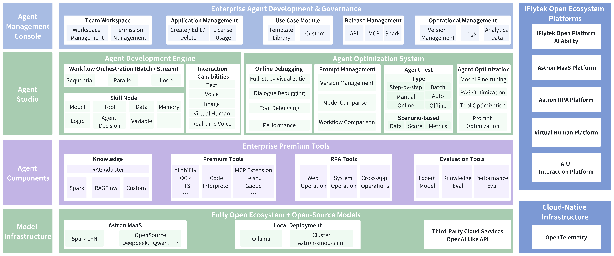

# Astron Agent - Agent Development Platform

<div align="center">


**Astron Agent is an enterprise-grade Agent development platform designed for AI developers and organizations of all types.**

[](LICENSE)
[](https://github.com/iflytek/astron-agent/releases)
[](https://github.com/iflytek/astron-agent/actions)
[](https://codecov.io/gh/iflytek/astron-agent)
[](https://github.com/iflytek/astron-agent/stargazers)

English | [简体中文](README-zh.md)

</div>

## 📑 Table of Contents

- [🔭 What is Astron Agent?](#-What-is-Astron-Agent)
- [🛠️ Tech Stack](#%EF%B8%8F-tech-stack)
- [🚀 Quick Start](#-quick-start)
  - [Option 1: Docker Compose](#option-1-docker-compose-recommended-for-quick-start)
  - [Option 2: Helm](#option-2-helm-for-kubernetes-environments)
- [📖 Usage Guide](#-usage-guide)
- [📚 Documentation](#-documentation)
- [🤝 Contributing](#-contributing)
- [🌟 Star History](#-star-history)
- [📞 Support](#-support)
- [📄 License](#-license)

## 🔭 What is Astron Agent
Astron Agent is an enterprise-grade Agent development platform designed for AI developers and organizations of all types. 
It not only provides full-lifecycle capabilities covering model hosting, application development, performance optimization, and access control, but also innovatively integrates intelligent RPA. This allows Agents not only to “think,” but also to truly “act,” completing complex task chains across digital systems and desktop environments.

### Why Choose Astron Agent?
- **Unified Technology Base, Stable and Reliable:** Shares the same core technology with [iFLYTEK Astron Agent Platform](https://agent.xfyun.cn), inheriting its proven enterprise-grade stability.  
- **Closed Loop of Thinking + Acting:** Deep integration of intelligent RPA enables Agents to move from "generating answers" to "automatically completing tasks."  
- **Dual Value for Developers and Enterprises:** Developers can quickly get started and expand, while SMEs can efficiently implement digital workflows.  

### Key Features
- **Enterprise-Grade High Availability:** Full-stack capabilities for development, building, optimization, and management. Supports one-click deployment with strong reliability.  
- **Intelligent RPA Integration:** Enables cross-system process automation, empowering Agents with controllable execution to achieve a complete loop “from decision to action.”  
- **Ready-to-Use Tool Ecosystem:** Integrates massive AI capabilities and tools from the [iFLYTEK Open Platform](https://www.xfyun.cn), validated by millions of developers, supporting plug-and-play integration without extra development.  
- **Flexible Model Support:** Offers diverse access methods, from rapid API-based model access and validation to one-click deployment of enterprise-level MaaS (Model as a Service) on-premises clusters, meeting needs of all scales.  

### Developer Support
- **Multi-language Backend:** Supports mainstream languages such as Java, Go, and Python; frontend adapted to TypeScript + React stack.  
- **Comprehensive Toolchain:** Provides API documentation, deployment guides, and troubleshooting manuals to reduce learning and maintenance costs.  
- **One-Click Deployment:** Built-in Dockerized environment for out-of-the-box setup and rapid project launch.  

## 🛠️ Tech Stack

- **Backend**: Java 21, Spring Boot 3, Go, Python 3.11
- **Frontend**: TypeScript 5, React 18
- **Database**: MySQL 8
- **Cache**: Redis
- **Message Queue**: Apache Kafka
- **Infrastructure**: Docker, MinIO
- **Quality Tools**: Checkstyle, PMD, SpotBugs, ESLint, gocyclo, staticcheck, golangci-lint, black, isort, flake8, mypy, pylint

## Architecture Overview



## 🚀 Quick Start

We offer two deployment methods to meet different scenarios:

### Option 1: Docker Compose (Recommended for Quick Start)

```bash
# Clone the repository
git clone https://github.com/iflytek/astron-agent.git
cd astron-agent

# Start Casdoor authentication service
cd docker/casdoor
docker-compose up -d

# Start AstronAgent core services
cd ../astronAgent
docker compose up -d
```

Access the platform at http://localhost/

### Option 2: Helm (For Kubernetes Environments)

> 🚧 **Note**: Helm charts are currently under development. Stay tuned for updates!

```bash
# Coming soon
# helm repo add astron-agent https://iflytek.github.io/astron-agent
# helm install astron-agent astron-agent/astron-agent
```

---

> 📖 For complete deployment instructions and configuration details, see [Deployment Guide](docs/DEPLOYMENT_GUIDE.md)

## 📖 Usage Guide

For detailed usage instructions, please refer to [Quick Start Guide](https://www.xfyun.cn/doc/spark/Agent03-%E5%BC%80%E5%8F%91%E6%8C%87%E5%8D%97.html)

## 📚 Documentation

- [🚀 Deployment Guide](docs/DEPLOYMENT_GUIDE.md)
- [🔧 Configuration](docs/CONFIGURATION.md)
- [🚀 Quick Start](https://www.xfyun.cn/doc/spark/Agent02-%E5%BF%AB%E9%80%9F%E5%BC%80%E5%A7%8B.html)
- [📘 Development Guide](https://www.xfyun.cn/doc/spark/Agent03-%E5%BC%80%E5%8F%91%E6%8C%87%E5%8D%97.html#_1-%E6%8C%87%E4%BB%A4%E5%9E%8B%E6%99%BA%E8%83%BD%E4%BD%93%E5%BC%80%E5%8F%91)
- [💡 Best Practices](https://www.xfyun.cn/doc/spark/AgentNew-%E6%8A%80%E6%9C%AF%E5%AE%9E%E8%B7%B5%E6%A1%88%E4%BE%8B.html)
- [📱 Use Cases](https://www.xfyun.cn/doc/spark/Agent05-%E5%BA%94%E7%94%A8%E6%A1%88%E4%BE%8B.html)
- [❓ FAQ](https://www.xfyun.cn/doc/spark/Agent06-FAQ.html)

## 🤝 Contributing

We welcome contributions of all kinds! Please see our [Contributing Guide](CONTRIBUTING.md)

## 🌟 Star History

<div align="center">
  
</div>

## 📞 Support

- 💬 Community Discussion: [GitHub Discussions](https://github.com/iflytek/astron-agent/discussions)
- 🐛 Bug Reports: [Issues](https://github.com/iflytek/astron-agent/issues)

## 📄 Open Source License

This project is licensed under the [Apache 2.0 License](LICENSE).

---

<div align="center">

**Developed and maintained by iFLYTEK**

[](https://github.com/iflytek)
[](https://github.com/iflytek/astron-agent)
[](https://github.com/iflytek/astron-agent/fork)
[](https://github.com/iflytek/astron-agent/watchers)

</div>
